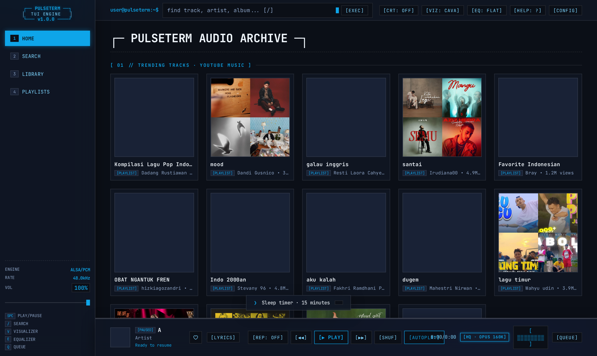
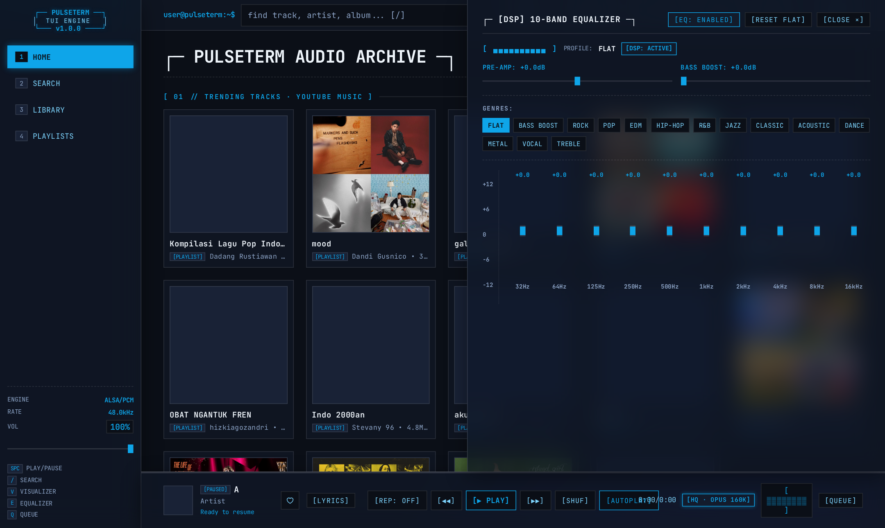
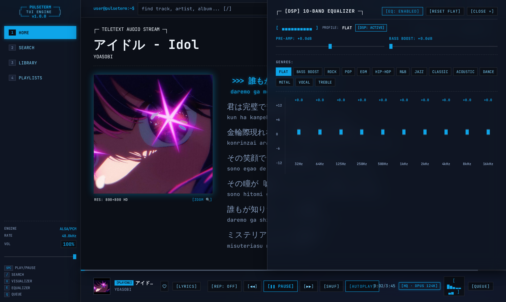

# PulseTerm // Minimalist TUI Audio Player

A high-performance, lightweight terminal-style YouTube Music audio player. Built with an authentic TUI monospace aesthetic, zero tracking, zero bloat, CAVA spectrum analyzer, 10-band DSP parametric equalizer with genre presets, and synchronized multi-script teletext lyrics.

---

## 📸 Screenshots

### 1. Dashboard & Smart Taste Recommendations
> Monospace terminal UI with trending tracks, customized taste profiler lanes, and retro playback status.



---

### 2. 10-Band DSP Parametric Equalizer
> 32Hz to 16kHz audio mastering with pre-amp headroom, bass booster, and 14 genre presets.



---

### 3. Synchronized Teletext Lyrics & Multi-Script Romanization
> Real-time timed lyrics with automatic Romaji (Japanese), Romaja (Korean), Pinyin (Chinese), and Cyrillic transliteration alongside 800x800 HD album artwork.



---

## ✨ Features

- **TUI Monospace Aesthetic**: Clean ASCII borders, retro CRT scanline raster mode, and customizable color schemes (Dark, Amber, OLED, Cyberpunk, Nordic, Liquid Glass, Soft Dark).
- **High-Fidelity Opus 48kHz Audio**: Direct Opus 160kbps audio stream extraction with lossless Web Audio API DSP processing chain and anti-clipping studio limiter.
- **10-Band DSP Parametric Equalizer**: 32Hz to 16kHz faders with Pre-amp headroom and Bass Booster controls.
- **14 Studio Genre Presets**: Flat, Bass Boost, Rock, Pop, Electronic/EDM, Hip-Hop, R&B, Jazz, Classical, Acoustic, Dance, Metal, Vocal, and Treble Boost.
- **Synchronized Teletext Lyrics**: Real-time karaoke-style line tracking with auto-scroll and manual seek navigation.
- **Non-Latin Script Auto-Romanization**: Dual-script lyrics rendering with automatic Romanization:
  - 🇯🇵 Japanese Kanji / Kana ➔ **Romaji** (via pykakasi)
  - 🇰🇷 Korean Hangul ➔ **Romaja** (via korean-romanizer)
  - 🇨🇳 Chinese Hanzi ➔ **Pinyin** (via pypinyin)
  - 🇷🇺 Cyrillic Script ➔ **Transliteration** (via cyrtranslit)
- **HD Album Artwork & Lightbox**: High-resolution 800x800 cover extraction with 1200x1200 master zoom lightbox.
- **Smart Taste Profiler**: Dynamic listening telemetry recommending tailored playlists based on your top-played genres and artists.
- **Instant Deck Swapping & Crossfade**: Smooth gapless transitions between tracks.
- **Full Keyboard Navigation**: Command-line hotkeys for mouse-free operation.
- **Privacy First**: Zero tracking, zero telemetry, zero analytics, zero external CDNs.

---

## 🛠 Tech Stack

- **Backend**: Python 3.12 + FastAPI + Uvicorn + SQLite WAL
- **Audio Engine**: Web Audio API (BiquadFilterNode DSP chain, DynamicsCompressor limiter)
- **YouTube Audio**: ytmusicapi + yt-dlp + Stream proxying
- **Database**: SQLite via aiosqlite
- **Frontend**: Vanilla ES6 Modules + Pure CSS (zero frontend frameworks)
- **Visualizer**: High-performance canvas CAVA / Oscilloscope / VU / ASCII

---

## 🚀 Quick Start

```bash
# Clone the repository
git clone https://github.com/bandithijo/pulseterm.git
cd pulseterm

# Run setup (creates venv and installs dependencies)
chmod +x setup.sh
./setup.sh

# Start server
./manage.sh start
```

Access at **http://localhost:3000**

### Service Management

```bash
./manage.sh start    # Start server
./manage.sh stop     # Stop server
./manage.sh restart  # Restart server
./manage.sh status   # Check status
```

---

## ⌨️ Keyboard Shortcuts

| Shortcut | Description |
|:---|:---|
| `Space` | Play / Pause |
| `1, 2, 3, 4` | Quick switch: Home, Search, Library, Playlists |
| `/` | Focus search command prompt |
| `e` | Toggle 10-Band DSP Equalizer panel |
| `v` | Toggle CAVA spectrum visualizer HUD |
| `c` | Toggle CRT scanline raster effect |
| `q` | Toggle playback queue buffer drawer |
| `l` | Toggle teletext lyrics overlay |
| `n` / `p` | Next track / Previous track |
| `←` / `→` | Seek backward / forward 5 seconds |
| `↑` / `↓` | Volume up / down |
| `m` | Toggle mute |
| `s` | Toggle shuffle mode |
| `r` | Cycle repeat mode (none / all / one) |
| `t` | Cycle terminal color themes |
| `Esc` | Dismiss active drawer or modal |
| `?` | Show command keymap |

---

## 📄 License

GPL-3.0