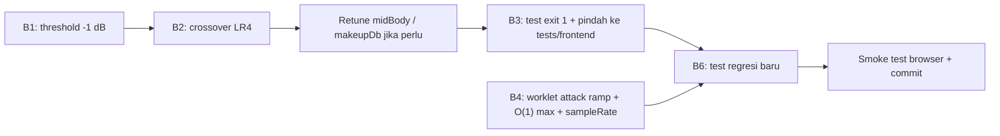

# Audio Engine Bugfix Guide (setelah T9 fix)

> Baseline: commit `6343842` — *fix(audio): bypass spatial limiter in OFF mode and correct worklet name*.
> Semua angka di dokumen ini **diukur**, bukan perkiraan. Script pengukuran:
> `scratch/diag_crossover.mjs`, `scratch/diag_makeup.mjs` (jalankan dengan `node <file>` dari root repo).

## Ringkasan

| ID | Severity | Area | Masalah | Status |
|----|----------|------|---------|--------|
| B1 | 🔴 High | `spatial.js` | `masterLimiter` (DynamicsCompressor -14 dB) menambah **auto-makeup gain ~+8 dB** → gain berubah **10–12 dB** tergantung volume input pada mode aktif | Terkonfirmasi |
| B2 | 🔴 High | `spatial.js` | Crossover 150 Hz (HPF dry + LPF bass Butterworth orde-2) dijumlahkan sefase → **notch -9 s/d -14 dB** di 150–200 Hz | Terkonfirmasi |
| B3 | 🔴 High | `spatial.test.mjs` | Test **selalu exit 0** walau gagal, dan berada di luar `tests/frontend/` → saat ini **9 kriteria gagal tapi tidak terlihat** | Terkonfirmasi |
| B4 | 🟠 Medium | `limiter_worklet.js` | Worklet baru aktif sejak fix T9; attack instan tanpa ramp (klik/distorsi), scan O(240) per sampel, sample rate hard-coded 48 kHz | Terkonfirmasi (review kode) |
| B5 | 🟡 Low | `spatial.js` + `equalizer.js` | Limiting berlapis di mode aktif (spatial `masterLimiter` + worklet brickwall) | Desain |
| B6 | 🟡 Low | Test coverage | Tidak ada test untuk mode aktif (flatness, level-independence) maupun worklet | Gap |

> [!IMPORTANT]
> **Koreksi atas laporan sebelumnya:** setelah commit `6343842` dilaporkan "89/89 pass". Itu benar untuk
> `tests/frontend/`, tetapi `frontend/js/spatial.test.mjs` mencetak `FAILED ONE OR MORE CRITERIA`
> (Lead 1k, Noise RMS di 3 mode; Side 3.2k di Concert; Muddy di Studio). Kegagalan ini tidak terlihat karena B3.
> Penyebabnya bukan fix T9 itu sendiri: baseline OFF sebelumnya ikut terkompresi (~-2.2 dB), sehingga selisih
> mode aktif vs OFF tampak lebih kecil. Setelah OFF bersih, efek B1 terekspos.

---

## B1 — Spatial masterLimiter bertindak sebagai loudness maximizer

### Bukti

`DynamicsCompressorNode` di Web Audio menerapkan **makeup gain otomatis** berdasarkan threshold/ratio.
Dengan threshold -14 dB, ratio 20:1 → makeup ≈ +8 dB. Hasil pengukuran (tone 1 kHz, `diag_makeup.mjs`):

| Threshold | Mode | Input -30 dBFS | Input -3 dBFS | Swing |
|-----------|------|---------------:|--------------:|------:|
| **-14 (sekarang)** | studio | +7.38 dB | -5.02 dB | **12.40 dB** |
| | wide | +6.78 dB | -4.70 dB | **11.48 dB** |
| | concert | +5.62 dB | -4.50 dB | **10.13 dB** |
| **-1 (usulan)** | studio | -0.03 dB | -0.31 dB | 0.28 dB |
| | wide | -0.63 dB | -0.63 dB | 0.00 dB |
| | concert | -1.79 dB | -1.79 dB | 0.00 dB |

**Dampak ke pendengar:** saat Spatial aktif, bagian lagu yang pelan (intro, ballad) naik ~+7 dB dan bagian
keras tertekan ~-5 dB → dinamika rata, *pumping*, dan perbandingan A/B OFF vs aktif tidak adil (aktif selalu
terdengar "lebih keras"). Ini juga penyebab kegagalan **Lead 1k** dan **Noise RMS** di `spatial.test.mjs`.

### Perbaikan

File: [frontend/js/spatial.js](../frontend/js/spatial.js) (blok `masterLimiter` di `init()`)

```js
// Ceiling pengaman saja, bukan kompresor. Threshold dekat 0 dBFS → auto-makeup ≈ +0.6 dB.
this.masterLimiter.threshold.value = -1;
this.masterLimiter.knee.value = 0;
this.masterLimiter.ratio.value = 20;
this.masterLimiter.attack.value = 0.001;
this.masterLimiter.release.value = 0.1;
```

- Perbarui komentar di atas blok tersebut (saat ini menyebut "-8 dB / 12:1", tidak sesuai kode).
- Dengan threshold -1, nilai `makeupDb` yang ada sudah hampir loudness-matched dengan OFF
  (studio -0.03, wide -0.63, concert -1.79 dB). Opsional: naikkan `concert.makeupDb` ~+1 dB jika target ±1 dB.
- **Jangan** mengompensasi dengan memperlebar toleransi test.

### Verifikasi

- `node scratch/diag_makeup.mjs` → swing ≤ 1 dB di semua mode.
- `spatial.test.mjs`: Lead 1k dan Noise RMS lolos; Max Peak tetap ≤ 0 dBFS.

---

## B2 — Notch crossover di 150 Hz

### Bukti

Di mode aktif, sinyal dibagi: `dryHPF` (highpass 150 Hz, Q 0.707) → `directGain`, dan `bassLPF`
(lowpass 150 Hz, Q 0.707) → `bassMonoGain`. Jumlah LP2 + HP2 Butterworth sefase:

```
H(s) = (s² + 1) / (s² + √2·s + 1)   → nol di s = jω₀  → notch tepat di 150 Hz
```

Respons terukur @ -30 dBFS (limiter idle), dB relatif input (`diag_crossover.mjs`):

| Mode | 60 | 100 | 125 | **150** | **175** | 200 | 300 | 1000 |
|------|---:|----:|----:|--------:|--------:|----:|----:|-----:|
| off | 0.00 | 0.00 | 0.00 | 0.00 | 0.00 | 0.00 | 0.00 | 0.00 |
| studio | 5.43 | 3.51 | 0.17 | **-5.86** | -0.66 | 4.98 | 8.69 | 7.38 |
| wide | 5.41 | 4.70 | 3.15 | 0.14 | **-2.89** | 0.49 | 6.28 | 6.78 |
| concert | 5.13 | 4.91 | 3.88 | 1.62 | **-1.41** | -1.05 | 4.16 | 5.62 |

Relatif terhadap level sekitarnya (~+5…+8 dB karena B1), lubangnya **≈ -14 dB (studio)** dan **≈ -8…-9 dB
(wide/concert)** di area fundamental kick, bass, dan body vokal pria. Lokasi notch bergeser karena path wet
(HRTF/reverb) ikut terjumlah.

### Perbaikan

Ganti ketiga filter 150 Hz (`dryHPF`, `bassLPF`, `spatialBusHPF`) dengan **Linkwitz-Riley orde-4 (LR4)**:
dua biquad Butterworth (Q 0.707) berseri per cabang. LP4 + HP4 LR menjumlah ke allpass (magnitude flat).

```js
_createLR4(type, freq) {
    const a = this.audioCtx.createBiquadFilter();
    const b = this.audioCtx.createBiquadFilter();
    for (const f of [a, b]) { f.type = type; f.frequency.value = freq; f.Q.value = Math.SQRT1_2; }
    a.connect(b);
    return { input: a, output: b };
}
```

- `inputNode → dryLR4HP.input`, `dryLR4HP.output → directGain`
- `inputNode → bassLR4LP.input` (set `channelCount = 1`, `channelCountMode = 'explicit'` di **kedua** biquad),
  `bassLR4LP.output → bassMonoGain`
- `spatialBus → spatialLR4HP.input`, `spatialLR4HP.output → splitter / convolver`
  (perbarui `_connectSpatialBuses` / `_disconnectSpatialBuses` agar men-disconnect kedua tahap).
- Pertahankan nama properti lama (`dryHPF`, `bassLPF`, `spatialBusHPF`) menunjuk ke tahap pertama bila ada
  kode lain/test yang memakainya — cek dengan `grep -rn "dryHPF\|bassLPF\|spatialBusHPF" frontend tests`.

> [!NOTE]
> Setelah crossover flat, sisa "warna" di 200–300 Hz (studio +8.69 dB @300 Hz) berasal dari `midBody` dan HRTF.
> Itu keputusan tonal, bukan bug — tetapi berpengaruh ke metrik **Muddy Articulation** studio
> (terukur -3.43, batas -3.0). Uji ulang setelah B1+B2; jika masih gagal, turunkan `studio.midBodyDb`
> ke -3 dB (terukur: articulation -4.95 → -3.21 hanya dari midBody pada kondisi B1 belum diperbaiki).

### Verifikasi

- `node scratch/diag_crossover.mjs`: di 100–200 Hz, tidak ada titik yang lebih rendah > 3 dB dari median
  60–300 Hz untuk mode yang sama.

---

## B3 — `spatial.test.mjs` menyembunyikan kegagalan

### Bukti

[frontend/js/spatial.test.mjs](../frontend/js/spatial.test.mjs) baris akhir:

```js
if (!allPass) { console.error("FAILED ONE OR MORE CRITERIA"); process.exit(0); }  // ← exit 0
runTests().catch(e => { console.error(e); process.exit(0); });                    // ← exit 0
```

`node --test` melaporkannya sebagai ✔ pass. File juga tidak ikut `node --test tests/frontend/`.

### Perbaikan

1. Ganti kedua `process.exit(0)` menjadi `process.exit(1)` (atau bungkus kriteria dengan `node:test` +
   `assert`, satu `test()` per mode agar laporan granular).
2. Pindahkan ke `tests/frontend/spatial-quality.test.mjs` (sesuaikan import ke `../../frontend/js/spatial.js`)
   **atau** tambahkan ke script test di `package.json` agar dijalankan bersama suite lain.
3. Lakukan langkah ini **setelah** B1+B2, kalau tidak suite langsung merah.

---

## B4 — Kualitas & performa `limiter_worklet.js`

Worklet ini tidak pernah benar-benar berjalan sebelum commit `6343842` (salah nama processor), sehingga
belum pernah teruji di produksi.

| Masalah | Lokasi | Dampak |
|---------|--------|--------|
| Attack instan: `currentGain = targetGain` langsung saat peak baru masuk window | `process()` L61–62 | Lompatan gain = modulasi amplitudo tajam → klik/distorsi pada transient. Lookahead 5 ms tidak dimanfaatkan untuk ramp. |
| Scan seluruh `peakBuffer` (240) tiap sampel | L47–51 | ~11.5 juta perbandingan/detik; risiko *glitch/underrun* di perangkat lemah |
| `48000` hard-coded | L8, L15 | Bila AudioContext fallback ke 44.1 kHz, lookahead & release meleset |
| Sampel delayed sudah tertimpa sebelum scan (off-by-one) | L35–43 | Sampel output tidak tercakup window; hanya ditangkap oleh *safety clamp* per-sampel |

### Perbaikan

- Gunakan global `sampleRate` (tersedia di `AudioWorkletGlobalScope`):
  `this.lookahead = Math.round(0.005 * sampleRate)`, `releaseCoeff = Math.exp(-1 / (0.080 * sampleRate))`.
- **Attack ramp:** saat `targetGain < currentGain`, turunkan gain linear/eksponensial menuju target selama
  `lookahead` sampel (koefisien attack ≈ `Math.exp(-1 / (lookahead / 4))`), sehingga gain sudah mencapai
  target tepat saat peak keluar dari delay line. Safety clamp tetap dipertahankan sebagai jaring terakhir.
- **Running max O(1) amortized:** monotonic deque (indeks + nilai) atau max per blok 128 sampel.
- Tulis ke buffer **setelah** scan, atau ukur window `lookahead + 1`, agar sampel yang dikeluarkan tercakup.
- Samakan logika dengan `computeLimiterGain` di `eq-core.js` (sudah punya test T8) atau ekstrak inti algoritma
  ke fungsi murni yang bisa diimpor test.

### Verifikasi

- Unit test baru: muat `limiter_worklet.js` dengan shim global (`AudioWorkletProcessor`, `registerProcessor`,
  `sampleRate`), panggil `process()` dengan blok 128 sampel:
  - sinus 0 dBFS → peak output ≤ -1 dBFS (+0.01 toleransi);
  - burst transient → selisih gain antar-sampel ≤ batas kecil (tidak ada step);
  - sinyal -20 dBFS → output = input yang di-delay (bit-transparan).
- Smoke test browser: konsol menampilkan `Limiter worklet loaded successfully` dan **tidak** ada
  `Failed to construct limiter worklet`.

---

## B5 — Limiting berlapis (desain)

Mode aktif: `spatial.masterLimiter` → `outputNode` → worklet brickwall (-1 dBFS) → analyser → destination.
Setelah B1 (threshold -1), dua tahap limiter berceiling sama. Pilihan:

- **A (disarankan):** pertahankan `masterLimiter` -1 dB sebagai pengaman engine standalone (test mengukur
  `spatial.outputNode` langsung), worklet tetap terminal. Overhead kecil, perilaku jelas.
- **B:** hapus `masterLimiter`, andalkan worklet/fallback compressor di `equalizer.js`. Lebih ramping, tapi
  test spatial harus memasang limiter sendiri agar kriteria Max Peak tetap bermakna.

## B6 — Gap test coverage

Tambahkan di `tests/frontend/`:

1. **Spatial level-independence:** untuk tiap mode aktif, `|gain(-30 dBFS) − gain(-6 dBFS)| ≤ 1.5 dB` (mencegah B1 kambuh).
2. **Crossover flatness:** sweep 60–300 Hz per mode, tidak ada dip > 3 dB dari median (mencegah B2 kambuh).
3. **Loudness match:** noise RMS mode aktif vs OFF dalam ±1.5 dB.
4. **Worklet unit test** (lihat B4).

---

## Urutan kerja



| Fase | Pekerjaan | File | Kriteria selesai |
|------|-----------|------|------------------|
| 1 | B1 | `spatial.js` | `diag_makeup.mjs` swing ≤ 1 dB |
| 2 | B2 (+ retune) | `spatial.js` | `diag_crossover.mjs` tanpa dip > 3 dB; T9 tetap 0.00 dB |
| 3 | B3 | `spatial.test.mjs`, `package.json` | Semua kriteria spatial lolos **dan** gagal → exit code ≠ 0 |
| 4 | B4 | `limiter_worklet.js` (+ test baru) | Unit test worklet lolos |
| 5 | B6 | `tests/frontend/*.test.mjs` | `node --test tests/frontend/` hijau |
| 6 | Smoke | browser | Worklet ter-load, tidak ada warning; dengar A/B OFF vs Studio pada lagu dinamis (ballad) |

Setiap fase di-commit terpisah agar mudah di-bisect.

## Perintah verifikasi

```bash
node scratch/diag_makeup.mjs          # B1
node scratch/diag_crossover.mjs       # B2
node frontend/js/spatial.test.mjs; echo "exit=$?"   # B3 (harus exit=0 hanya jika semua PASS)
node --test tests/frontend/           # seluruh suite
```
